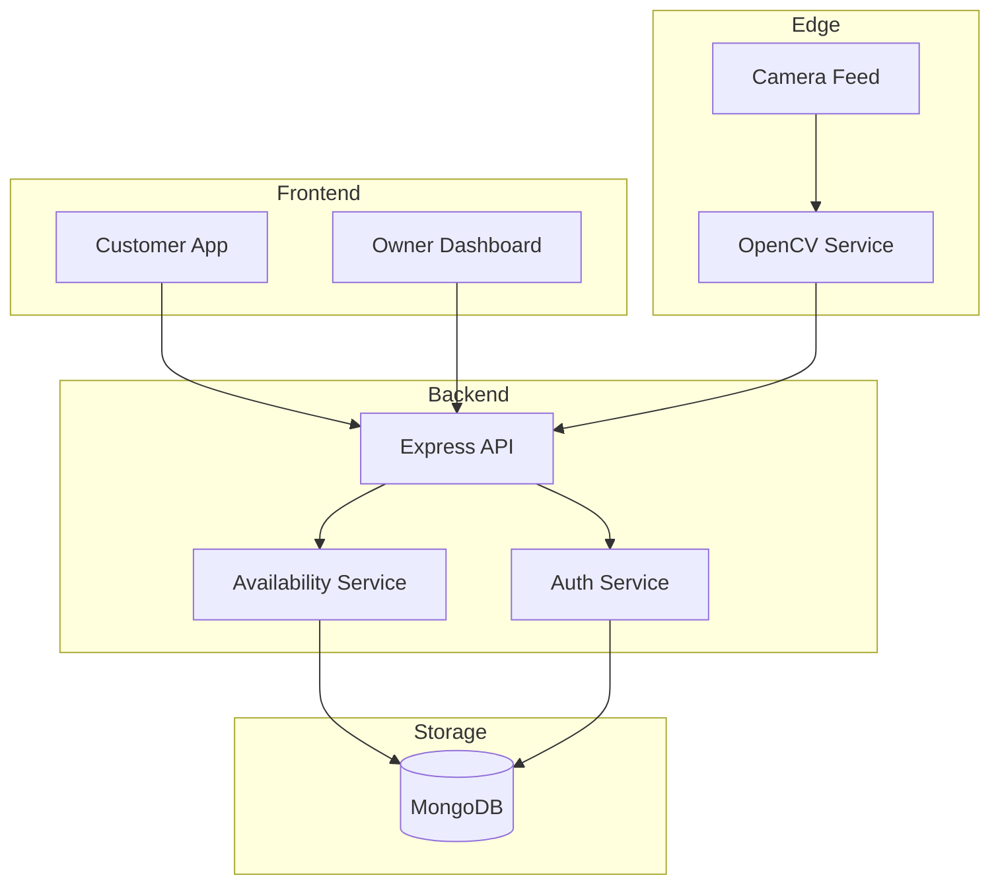
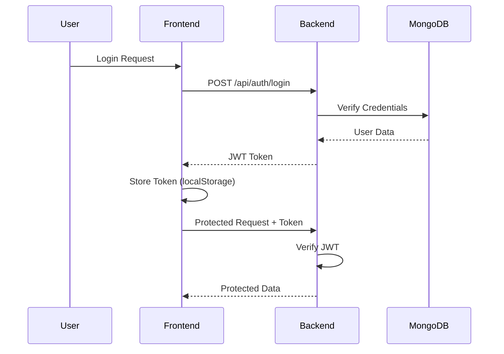

# 🅿️ Smart Parking System

[](https://www.mongodb.com/)
[](https://reactjs.org/)
[](https://nodejs.org/)
[](https://expressjs.com/)
[](https://opencv.org/)

A **full-stack, location-aware parking management system** that enables **parking owners to list and manage parking spaces** and allows **customers to discover, book, and navigate to nearby parking**.

The system optionally supports **camera-based occupancy detection using classical OpenCV techniques**, designed to work **without expensive sensors or heavy AI infrastructure**.

---
## 🌐 Live Demo

Access the deployed application here:  
👉 **https://smart-parking-system-sandy.vercel.app/**

🎥 **Demo Video**:  
👉 https://youtu.be/XXXXXXXX

## 🎯 Problem Statement

Urban and semi-urban parking faces multiple inefficiencies:

- ❌ No real-time parking visibility  
- ❌ Underutilized private and commercial parking spaces  
- ❌ Time and fuel wasted searching for parking  
- ❌ High cost of sensor-based smart parking solutions  
- ❌ Static listings that do not reflect actual availability  

Small parking owners often lack affordable tools to digitize and monetize unused parking capacity.

---

## 💡 Solution Overview

The Smart Parking System provides a **practical and cost-effective solution** through:

- ✅ Role-based access (Owner / Customer)
- ✅ Location-based parking discovery
- ✅ Manual parking slot configuration
- ✅ Optional camera-based occupancy detection
- ✅ Unified slot availability service
- ✅ Navigation support using external map services

The system is designed with **real-world deployment constraints** in mind.

---

## ✨ Key Features

### 👤 Parking Owners
- Register and manage parking lots
- Set parking location using interactive maps
- Configure parking charges
- Manually define parking slots on reference images
- Optionally enable camera-based detection
- Toggle between manual and camera-assisted slot management

### 🚗 Customers
- Secure login with role-based dashboard
- Discover nearby parking using current location
- View parking details and availability
- Book available parking slots
- Navigate to parking location using external maps

### ⚙️ Technical Highlights
- Modular backend architecture
- Optional OpenCV service running independently
- Unified slot availability logic
- Secure authentication using JWT
- Responsive and mobile-friendly UI

---

## 🏗️ System Architecture (High-Level)

### Actors
- **Parking Owner** – Manages parking resources  
- **Customer** – Searches, books, and navigates  
- **Camera Service (Optional)** – Updates slot occupancy  

### Core Components

| Component | Technology | Purpose |
|--------|------------|--------|
| Frontend | React + Vite + Tailwind CSS | User interface |
| Backend | Node.js + Express.js | API & business logic |
| Database | MongoDB | Persistent storage |
| CV Service (Optional) | Python + OpenCV | Slot occupancy detection |

> ⚠️ Camera-based detection is **optional** and runs as a **local/edge service**.  
> The system remains functional even without camera integration.

### Data Flow



---

## 📍 Location Handling

To improve location accuracy:

- Initial location is obtained using browser geolocation
- Users can manually adjust their location on the map
- Reverse geocoding is performed using **OpenStreetMap (Nominatim)**

This approach improves accuracy **without paid APIs**.

### Implementation Details

```javascript
// Reverse geocoding using Nominatim (free)
const response = await fetch(
  `https://nominatim.openstreetmap.org/reverse?lat=${lat}&lon=${lng}&format=json`
);
```

---

## 🔐 Authentication & Security

- JWT-based authentication with token expiration
- Role-based access control (Owner vs Customer)
- Password hashing using bcrypt with salt rounds
- Optional **email OTP verification during registration**
- Protected backend routes with middleware

### Security Flow



Email OTP verification is lightweight, free, and only used during signup.

---

## 🔄 Slot Availability Logic

Slot availability is determined through a **unified availability service**:

```
┌─────────────────────────────────────────────────────────┐
│                  Availability Request                    │
└─────────────────────────────────────────────────────────┘
                           │
                           ▼
              ┌────────────────────────┐
              │  Check Detection Mode   │
              └────────────────────────┘
                    │           │
         Camera ON  │           │  Camera OFF
                    ▼           ▼
        ┌──────────────┐   ┌──────────────┐
        │ Query OpenCV │   │ Query Manual │
        │   Service    │   │    State     │
        └──────────────┘   └──────────────┘
                    │           │
                    ▼           ▼
              ┌────────────────────────┐
              │   Normalize Response    │
              │   Return Availability   │
              └────────────────────────┘
```

- If camera detection is enabled → fetch status from OpenCV service
- If disabled → use manual slot state
- Backend exposes a single normalized availability response

This ensures system stability even if the camera service is offline.

---

## 📷 Camera-Based Detection (Optional)

The OpenCV service uses **classical computer vision** techniques:

### Detection Pipeline

1. **Image Preprocessing**
   - Convert to grayscale
   - Apply Gaussian blur
   - Adaptive thresholding

2. **Slot Analysis**
   - Extract defined slot regions
   - Calculate pixel density
   - Compare against threshold

3. **Status Determination**
   ```
   if pixel_count > threshold:
       status = "occupied"
   else:
       status = "empty"
   ```

### Why Classical CV over Deep Learning?

| Aspect | Classical CV | Deep Learning |
|--------|-------------|---------------|
| Hardware | Runs on any CPU | Requires GPU |
| Setup | No training needed | Requires dataset |
| Latency | Low (~50ms) | Higher (~200ms) |
| Cost | Free | Cloud inference costs |

> The system also supports **YOLO-based detection** for higher accuracy when GPU is available.

---

## 🧭 Navigation Support

After booking confirmation:

1. Parking coordinates are retrieved from the booking
2. A navigation link is generated dynamically
3. User is redirected to Google Maps or OpenStreetMap

```javascript
// Navigation link generation
const navigationUrl = `https://www.google.com/maps/dir/?api=1&destination=${lat},${lng}`;
window.open(navigationUrl, '_blank');
```

No custom routing or traffic prediction is implemented — we leverage existing navigation providers.

---

## 📁 Project Structure

```
Smart-Parking-System/
│
├── client/                          # React Frontend
│   ├── src/
│   │   ├── components/              # Reusable UI components
│   │   │   ├── Navbar.jsx
│   │   │   ├── Map.jsx
│   │   │   └── SlotEditor.jsx
│   │   ├── pages/                   # Route-level pages
│   │   │   ├── Login.jsx
│   │   │   ├── Register.jsx
│   │   │   ├── OwnerDashboard.jsx
│   │   │   └── UserDashboard.jsx
│   │   ├── services/                # API layer
│   │   │   └── api.js
│   │   └── App.jsx
│   ├── tailwind.config.js
│   └── package.json
│
├── server/                          # Node.js Backend
│   ├── config/
│   │   └── db.js                    # MongoDB connection
│   ├── controllers/
│   │   ├── authController.js        # Login/Register logic
│   │   ├── lotController.js         # Parking lot CRUD
│   │   └── bookingController.js     # Booking management
│   ├── models/
│   │   ├── User.js
│   │   ├── ParkingLot.js
│   │   └── Booking.js
│   ├── routes/
│   │   ├── authRoutes.js
│   │   ├── lotRoutes.js
│   │   └── bookingRoutes.js
│   ├── middleware/
│   │   └── auth.js                  # JWT verification
│   ├── services/
│   │   └── availabilityService.js   # Unified slot logic
│   └── server.js
│
├── server/opencv_service/           # Python CV Module
│   ├── service.py                   # Flask API
│   ├── occupancy_detector.py        # Detection logic
│   ├── yolo_detector.py             # YOLO integration
│   └── requirements.txt
│
├── .gitignore
├── package.json                     # Root scripts
├── start-all.bat                    # Windows startup
└── README.md
```

---

## 💻 Technology Stack

### Frontend
| Technology | Purpose |
|------------|---------|
| React 18 | UI library |
| Vite | Build tool |
| Tailwind CSS | Styling |
| React Router | Navigation |
| Leaflet | Interactive maps |
| Axios | HTTP client |

### Backend
| Technology | Purpose |
|------------|---------|
| Node.js | Runtime |
| Express.js | Web framework |
| MongoDB | Database |
| Mongoose | ODM |
| JWT | Authentication |
| bcryptjs | Password hashing |
| Nodemailer | Email service |

### Computer Vision
| Technology | Purpose |
|------------|---------|
| Python 3.8+ | Language |
| Flask | API server |
| OpenCV | Image processing |
| NumPy | Numerical ops |
| Ultralytics | YOLO (optional) |

---

## 🚀 Getting Started

### Prerequisites

- Node.js v16+
- Python 3.8+
- MongoDB (local or Atlas)
- Git

### Installation

```bash
# Clone repository
git clone https://github.com/Apurvasharma1001/Smart-Parking-System.git
cd Smart-Parking-System

# Install all dependencies
npm run install-all

# Configure environment
cd server
cp .env.example .env
# Edit .env with your MongoDB URI and JWT secret
```

### Environment Variables

```env
PORT=5000
MONGODB_URI=mongodb+srv://<user>:<pass>@cluster.mongodb.net/parkit
JWT_SECRET=your_secret_key_min_32_chars
CLIENT_URL=http://localhost:5173
OPENCV_SERVICE_URL=http://localhost:5001
```

### Running the Application

```bash
# Start all services (recommended)
npm run dev:all

# Or start individually
npm run server    # Backend on :5000
npm run client    # Frontend on :5173
npm run opencv    # CV Service on :5001
```

---

## 📡 API Endpoints

### Authentication
| Method | Endpoint | Description |
|--------|----------|-------------|
| POST | `/api/auth/register` | Register user |
| POST | `/api/auth/login` | Login |
| GET | `/api/auth/me` | Get current user |
| POST | `/api/auth/forgot-password` | Request reset |

### Parking Lots
| Method | Endpoint | Description |
|--------|----------|-------------|
| GET | `/api/lots` | List all lots |
| POST | `/api/lots` | Create lot (Owner) |
| GET | `/api/lots/nearby` | Find nearby lots |
| PUT | `/api/lots/:id` | Update lot |

### Bookings
| Method | Endpoint | Description |
|--------|----------|-------------|
| POST | `/api/bookings` | Create booking |
| GET | `/api/bookings` | User bookings |
| DELETE | `/api/bookings/:id` | Cancel booking |

---

## 🌐 Deployment

### Frontend → Vercel
```bash
cd client && npm run build
vercel --prod
```

### Backend → Render
- Connect GitHub repo
- Set environment variables
- Auto-deploy on push

### Database → MongoDB Atlas
- Free tier available
- Whitelist IPs or use 0.0.0.0/0

### OpenCV Service
> ⚠️ Runs locally or on edge devices (Raspberry Pi).  
> Use **ngrok** to expose for cloud backend integration.

---

## ⚠️ Limitations

| Limitation | Reason |
|------------|--------|
| Manual slot setup | Initial configuration required |
| Camera lighting sensitivity | Classical CV limitation |
| Local CV service | Heavy dependencies |
| No payment integration | Out of current scope |

---

## 🔮 Future Scope

- 📱 Progressive Web App (PWA)
- 💳 Payment gateway integration
- 📊 Owner analytics dashboard
- 🔔 Push notifications
- ⚡ WebSocket real-time updates
- 🤖 Enhanced YOLO detection

---

## 🤝 Contributing

1. Fork the repository
2. Create feature branch (`git checkout -b feature/NewFeature`)
3. Commit changes (`git commit -m 'Add NewFeature'`)
4. Push to branch (`git push origin feature/NewFeature`)
5. Open Pull Request

---

## 📄 License

MIT License - see [LICENSE](LICENSE) for details.

---

## 👨‍💻 Author

**Apurva Sharma**  
GitHub: [@Apurvasharma1001](https://github.com/Apurvasharma1001)

---

<div align="center">

⭐ **Star this repo if you found it helpful!**

</div>
